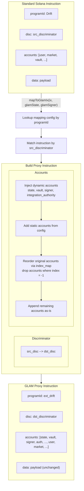

# ix-mapper

GLAM vaults execute DeFi operations through integration programs that enforce access control and policy checks. **This SDK transforms standard Solana instructions into their GLAM-proxied equivalents by remapping accounts and instruction discriminators according to predefined mapping configurations.**

## Installation

```bash
npm install @glamsystems/ix-mapper
```

## Usage

```typescript
import { PublicKey, SystemProgram } from "@solana/web3.js";
import { mapToGlamIx } from "@glamsystems/ix-mapper";

// GLAM state PDA (identifies the vault)
const glamState = new PublicKey("...");

// Signer should be the vault owner or a delegate
const glamSigner = new PublicKey("...");

// The vault PDA is derived from the state PDA internally
const glamVault = getVaultPda(glamState);

// Build a standard Solana instruction as if signing from the vault PDA
const transferIx = SystemProgram.transfer({
  fromPubkey: glamVault,
  toPubkey: recipient,
  lamports,
});

// Transform to a GLAM proxy instruction
const glamInstruction = mapToGlamIx(transferIx, glamState, glamSigner);

// glamInstruction can now be added to a transaction
```

### Staging Environment

To use staging program deployments, pass `staging = true`:

```typescript
const glamInstruction = mapToGlamIx(transferIx, glamState, glamSigner, true);
```

## API

### `mapToGlamIx(ix, glamState, glamSigner, staging?)`

Transforms a standard Solana `TransactionInstruction` into a GLAM proxy instruction.

**Parameters:**

| Parameter    | Type                     | Description                                       |
| ------------ | ------------------------ | ------------------------------------------------- |
| `ix`         | `TransactionInstruction` | The original Solana instruction to transform      |
| `glamState`  | `PublicKey`              | The GLAM state PDA that identifies the vault      |
| `glamSigner` | `PublicKey`              | The vault owner or delegate signing the operation |
| `staging`    | `boolean` (optional)     | Use staging program IDs (default: `false`)        |

**Returns:** `TransactionInstruction | null` - The transformed instruction, or `null` if the program/instruction is not supported or does not require remapping.

### `getVaultPda(statePda, staging?)`

Derives the vault PDA from a state PDA.

### `getIntegrationAuthority(integrationProgram)`

Derives the integration authority PDA for a given proxy program.

## How It Works


